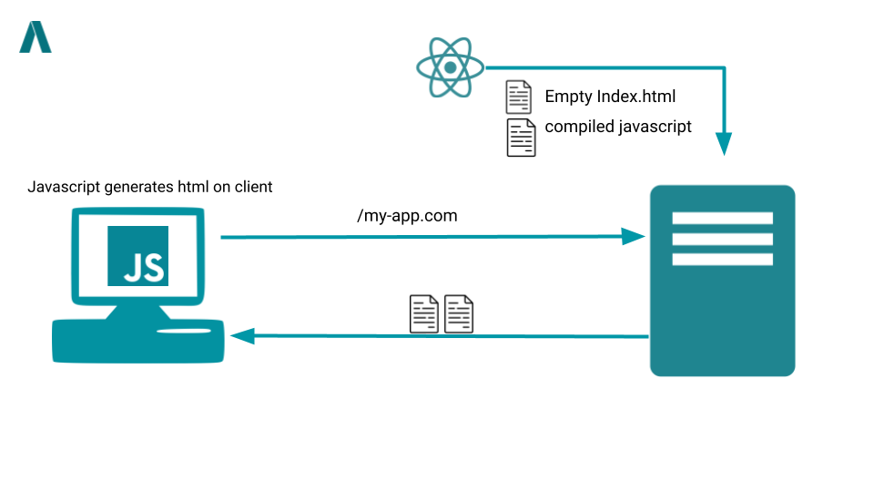
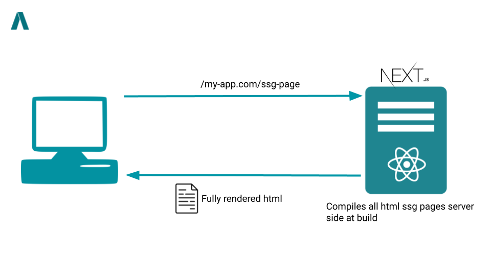
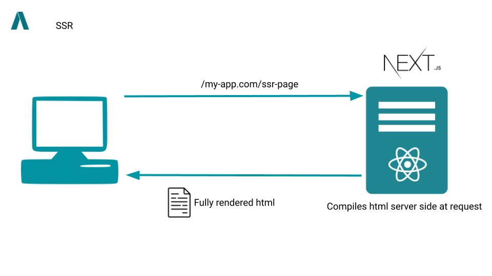

# Project 5: Meta Framework Next.js

Meta JavaScript frameworks, like Next.js, are tools built on top of JavaScript frameworks (e.g., React, Vue, or Angular) to simplify development, improve performance, and add advanced features.

1. What is a Meta JavaScript Framework?
   Definition: A meta JavaScript framework is a higher-level abstraction built on top of a base framework, such as React or Vue. These frameworks provide additional features and streamline common tasks like routing, server-side rendering (SSR), and optimization.
   Purpose: They reduce repetitive work, integrate best practices, and make it easier to build scalable and performant web applications.
   Examples: Next.js (built on React), Nuxt.js (built on Vue), SvelteKit (built on Svelte).
2. Why Use a Meta Framework?

   Meta frameworks enhance productivity by handling:

**Rendering Strategies**: Support multiple rendering options.
**Routing**: Define page structure without needing to manually set up routes.
**Performance Optimization**: Provide built-in optimizations for assets, lazy loading, and server-side caching.
**Developer Experience**: Offer tools like hot reloading, TypeScript support, and better debugging.

In Next.js, understanding **rendering types** is crucial as it determines **when** and **where** your application's pages or components are rendered. The choice of rendering method affects performance, user experience, and search engine optimization (SEO).

---

## Rendering Strategies in Web Development

Rendering is the process of generating HTML for your application. There 3 ways this can happen:

1. **On the Client-Side - Client Side Rendering (CSR)**:
   
   A traditional react app is rendered client side where the browser starts with a shell of an html page (`
`)
   The browser then fetches the javascript file containing the react code to render and make interactive the content to the page

2. **Dynamic At Build Time Server-Side - Static Site Generation (SSG)**: render all pages at build time before the application is deployed.
   

3. **At Request Time Server-Side - Server Side Rendering (SSR)**:
   
   Builds the html page on the server each time it's requested by the user in the component we implement data fetching.

All rendering paradigms can be use in the same application

Next.js has made some breaking changes in their latest big release. We are going to cover the newer version which utilized the [**App Router**](https://nextjs.org/docs/app/building-your-application/routing). This is in contrast to the previous version which used the [**Pages Router**](https://nextjs.org/docs/pages/building-your-application/routing). For now, all Next.js documentation is split to cover each routing option separately, so make sure to pay attention to which documentation path you're on when doing your research.
