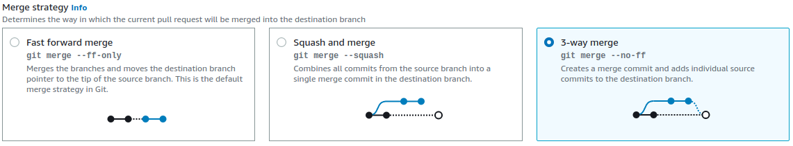

# Git commands and concepts

## Pull

"Pull" is when you get the latest changes from a remote repository (like GitHub) and merge them into your local repository. Imagine your friend has updated a shared document online, and you want to download those updates to your own copy.

## Merge

"Merge" is when you combine changes from one branch into another branch. Think of it like merging two versions of a document into one final version that includes changes from both.

In Git is the process of integrating changes from one branch into another.
If we are in a branch called `feature-branch` (e.g. "login-branch", "register-branch") , the coomand `git merge main` will attemt to merge into the main branch, the new elements existing in the `feature-branch`, or in other words, to include the changes of `feature-branch` inside `main` branch.

There are different situations when merging. Let's describe the 2 most common ones :

- Fast-Forward Merge:
    this happens when, prior to the merge, the `main branch` (the target branch, in this example) has no changes (new commits) since we created the `feature branch`.
    In this situation, merging `feature-branch` into `main` (by running `git merge main` while being in `feature branch`) will just move the main branch pointer forward to the latest commit in feature-branch.

- Three-Way Merge:
    This is the typical merge scenario where both branches have diverged.
    We created a `feature branch` that is a exact copy of `main branch`, but while working in our feature branch, there had been new commits made into the `main branch`.
    When we commit the changes of the `feature-branch` and we try to merge it into the main, that will create a **conflict*.
    Git will pause the merge process and allow you to manually resolve the conflicts. You'll decide how to combine the differing changes, then commit the result.
    In this scenario, Git uses the common ancestor of the branches and the changes from both branches to create a new merge commit.

Example :

1. You have a `main` branch with commits A and B.

```css
A - B (main)
```

2. Crete a `feature branch` and move to it

```powershell
git checkout -b feature-branch
```

3. We work on  `feature branch` and make new commits C and D.

```css
A - B (main)
     \
      C - D (feature-branch)
```

4. We move back to `main` , work there and make commits E and F.

```css
git checkout main

A - B - E - F (main)
     \
      C - D (feature-branch)
```

5. we want to merge `feature branch` into `main`

```sh
git merge feature-branch
```

6. After we resolve the conflicts, when we commit and push, Git creates a new merge commit G that combines changes from both branches.

```css
A - B - E - F - G (main)
     \       /
      C - D (feature-branch)
```

*commit G* is a merge commit that has two parent commits: *F* from the main branch and *D* from the feature branch.



## other git commands

- `git checkout branchName` : switches your working directory to the branch or commit named *branchName*. It's like switching to a different version of your document.

- `git pull origin branchName` : This command pulls changes from the branch named *branchName* on the remote repository called *origin* and merges them into your current branch. "origin" is usually the default name for your remote repository (`origin main` , `origin feature-branch`, etc... )

- `git branch --delete branchName` : This command deletes the branch named branchName from your local repository. It's like removing a version of a document you no longer need.

- `git fetch` :  This command downloads the latest changes from the remote repository but doesn't merge them into your local branches. It's like checking if there are updates to the shared document without actually incorporating them into your copy yet.

- `git fetch --prune` : This command fetches the latest changes from the remote repository and also removes references to branches that have been deleted on the remote. It's like updating your local list of versions to match the shared document's list, removing any versions that no longer exist.
